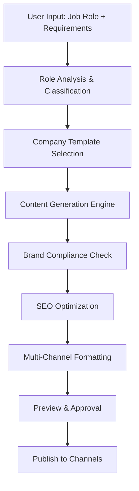

# RECRUIT_001: Create Job Posting
## AI-Powered Job Description Generation & Publishing

### 📋 Skill Overview
```yaml
skill_id: "RECRUIT_001"
skill_name: "Create Job Posting" 
domain: "Recruitment & Acquisition"
implementation_level: "Plug & Play"
priority: "High"
complexity_score: 4
estimated_dev_hours: 24-40
```

### 🎯 Business Objective
- **Primary Goal**: Generate professional, compelling job postings with minimal human input
- **Success Metrics**: 
  - Job posting creation time: <5 minutes (vs 30-60 minutes manual)
  - Application conversion rate: +25% vs template-based postings
  - Posting consistency score: >90% brand compliance
- **User Personas**: Recruiters, Hiring Managers, HR Business Partners
- **ROI Impact**: $2,000-5,000 saved per position (time + quality improvement)

### 🔧 Technical Requirements

#### Core Functions
```yaml
primary_function: "generate"
input_types: 
  - "natural_language" # "Create a job posting for Senior Software Engineer"
  - "structured_data"  # Role level, department, location requirements
  - "template_selection" # Company-specific job posting templates
output_types:
  - "formatted_job_posting" # Complete job description with all sections
  - "multi_channel_versions" # LinkedIn, Indeed, company website formats
  - "seo_optimized_content" # Keyword-optimized for job search visibility
```

#### System Connections
```yaml
sap_modules:
  - "SuccessFactors_Recruiting_Management"
  - "Position_Management" 
  - "Organization_Chart"
external_apis:
  - "LinkedIn_Job_Posting_API"
  - "Indeed_API" 
  - "Company_Career_Site_API"
  - "Salary_Benchmarking_Services"
mcp_protocols:
  - "HR_Data_Exchange" # Position hierarchies, org structure
  - "Content_Management" # Brand guidelines, template library
```

### 🏗️ Technical Architecture

#### Logic Flow


#### Required Tools
- **NLP Processing**: 
  - Role classification (engineering, sales, marketing, etc.)
  - Skill extraction from job requirements
  - Tone and style analysis for brand consistency
- **Data Access**: 
  - SAP Position Management APIs
  - Organization chart and reporting structures  
  - Historical job posting performance data
- **Business Logic**: 
  - Company branding rules engine
  - Salary range calculation based on level/location
  - Legal compliance validation (equal opportunity, etc.)
- **Output Generation**: 
  - Multi-format templating (HTML, plain text, structured data)
  - Channel-specific optimization (LinkedIn vs Indeed formatting)
  - PDF generation for internal approval workflows

### 📊 Implementation Specifications

#### Plug & Play Level
```yaml
setup_time: "2-4 hours"
configuration_required: false
prerequisites:
  - "SuccessFactors Recruiting Management license"
  - "Position Management data available"
  - "Basic user permissions: Job Posting Create/Edit"
out_of_box_features:
  - "Standard job posting templates"
  - "Role-based content suggestions"
  - "Basic brand compliance checking"
  - "Single-channel publishing (internal)"
```

### 🎨 Client Workshop Materials

#### Discovery Questions
1. **Current Process**: "How long does it typically take to create a job posting? Who's involved in the approval process?"
2. **Brand Guidelines**: "Do you have specific language, tone, or formatting requirements for job postings?"
3. **Channel Strategy**: "Which job boards and platforms do you typically use? Any exclusions or preferences?"
4. **Legal Requirements**: "Are there specific compliance requirements for your industry/location?"
5. **Approval Workflow**: "Who needs to review and approve job postings before publication?"

#### Configuration Options
```yaml
customizable_parameters:
  - company_branding:
      description: "Brand voice, tone, visual formatting"
      default_value: "Professional, inclusive"
      client_options: ["Corporate", "Startup", "Creative", "Technical"]
  
  - posting_channels:
      description: "Target job board distribution"
      default_value: ["Internal", "LinkedIn"]
      client_options: ["LinkedIn", "Indeed", "Monster", "Company_Site", "Niche_Boards"]
      
  - salary_disclosure:
      description: "Salary range visibility policy"
      default_value: "Range_Only"
      client_options: ["Hidden", "Range_Only", "Specific_Amount", "Negotiable"]

business_rules:
  - rule_name: "Equal Opportunity Language"
    configurable: false
    client_specific: true # Varies by country/state
    
  - rule_name: "Approval Requirements"
    configurable: true
    client_specific: true # Single approver vs multi-level
```

#### Success Criteria
- **Functional Requirements**: 
  - Generate complete job posting in <5 minutes
  - 100% brand compliance validation
  - Multi-channel format compatibility
- **Performance Benchmarks**: 
  - Response time: <30 seconds for generation
  - Accuracy: >95% content relevance score
  - Availability: 99.5% uptime during business hours
- **User Adoption**: 
  - >80% recruiter adoption within 30 days
  - <10 minutes training required per user
- **Maintenance**: 
  - Weekly content template updates
  - Monthly performance analytics review

### 🔍 Testing & Validation

#### Test Scenarios
```yaml
unit_tests:
  - "Role classification accuracy across job families"
  - "Template selection logic validation"
  - "Brand compliance rule enforcement"
integration_tests:
  - "SAP SuccessFactors API connectivity"
  - "Job board publishing endpoints"
  - "Approval workflow integration"
user_acceptance_tests:
  - "End-to-end job posting creation by recruiters"
  - "Multi-role posting scenarios (technical, sales, executive)"
  - "Error handling for incomplete input data"
```

#### Quality Assurance
- **Content Quality**: AI-generated content review by HR experts
- **Brand Consistency**: Automated brand guideline compliance checking
- **Legal Compliance**: Equal opportunity, accessibility, local labor law validation
- **Performance Monitoring**: Job posting engagement rates, application conversion

### 📈 Performance Optimization

#### Scalability Factors
```yaml
user_concurrency: "50 concurrent job posting creations"
data_volume: "10,000+ historical job postings for AI training"
response_time: "<30 seconds for complete job posting generation"
system_resources: 
  - cpu: "2 cores per 10 concurrent users"
  - memory: "4GB base + 1GB per AI model instance"
  - storage: "100MB per job posting (with attachments)"
```

#### Monitoring & Analytics
```yaml
key_metrics:
  - "Job posting generation volume (daily/weekly)"
  - "Time savings per posting vs manual creation"
  - "Brand compliance pass/fail rates"
  - "Application conversion rates by AI-generated vs manual postings"
  
alerting:
  - "Generation time >60 seconds (performance degradation)"
  - "Brand compliance failure rate >5%"
  - "API connection failures to job boards"
```

### 💰 Cost & ROI Analysis

#### Implementation Costs
```yaml
development_hours: 32 # Technical implementation
training_hours: 4 # User onboarding per recruiter
infrastructure: "$200/month" # AI processing, storage
ongoing_maintenance: "8 hours/month" # Content updates, monitoring
```

#### Expected Benefits
```yaml
time_savings: "50 minutes per job posting" # 60min manual -> 10min AI
cost_reduction: "$125 per posting" # Recruiter time at $150/hr
quality_improvement: "+25% application conversion rate"
consistency_gain: "90% brand compliance vs 60% manual"
volume_capacity: "+200% job posting throughput per recruiter"
```

#### Annual ROI (100 job postings/year)
- **Cost Savings**: $12,500 (time) + $5,000 (quality/conversion) = $17,500
- **Investment**: $4,800 (implementation) + $2,400 (annual maintenance) = $7,200
- **Net ROI**: 143% first year, 250%+ ongoing

### 🚀 Deployment Strategy

#### Rollout Phases
1. **Pilot** (Week 1-2): 
   - 2-3 senior recruiters
   - Technical roles only
   - Manual review of all generated content
   
2. **Beta** (Week 3-6):
   - All recruiting team members
   - Expand to all job families
   - Automated brand compliance checking
   
3. **Production** (Week 7+):
   - Full deployment across organization
   - Real-time job board publishing
   - Performance analytics dashboard
   
4. **Optimization** (Month 3+):
   - AI model fine-tuning based on usage data
   - Advanced personalization features
   - Integration with candidate matching algorithms

#### Change Management
- **Stakeholder Communication**: 
  - Executive: ROI metrics, competitive advantage
  - Recruiting Managers: Efficiency gains, quality improvements
  - Recruiters: Time savings, tool training, change benefits
- **Training Programs**: 
  - 30-minute tool introduction session
  - Hands-on workshop with real job posting creation
  - Best practices guide and quick reference cards
- **Support Structure**: 
  - Dedicated Slack channel for questions
  - Video tutorials for common use cases
  - Monthly office hours with technical support
- **Feedback Loops**: 
  - Weekly usage metrics review
  - Monthly user satisfaction surveys
  - Quarterly feature enhancement planning

### 🔧 Advanced Customization Options

#### Enterprise Features (Calibration Required)
```yaml
advanced_templates:
  - "Role-specific template libraries" 
  - "Department-specific language patterns"
  - "Location-based legal compliance rules"
  
workflow_integration:
  - "Multi-level approval workflows"
  - "Stakeholder notification automation"
  - "Budget approval integration"
  
analytics_enhancement:
  - "Competitive salary benchmarking"
  - "Job posting performance prediction"
  - "A/B testing for posting variations"
```

#### API Extensions
- **Candidate Sourcing**: Auto-search for passive candidates matching new job requirements
- **Market Intelligence**: Real-time competitor job posting analysis
- **Diversity Metrics**: Language bias detection and inclusive terminology suggestions

---

*This detailed specification provides complete implementation guidance for the Create Job Posting skill, ready for client workshops and technical development.*