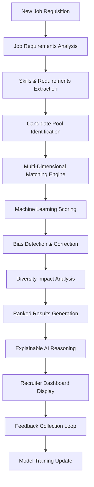

# RECRUIT_012: AI-Powered Candidate Matching
## Intelligent Candidate-Job Matching with Machine Learning

### 📋 Skill Overview
```yaml
skill_id: "RECRUIT_012"
skill_name: "AI-Powered Candidate Matching"
domain: "Recruitment & Acquisition"
implementation_level: "Machine Learning"
priority: "High"
complexity_score: 9
estimated_dev_hours: 120-200
```

### 🎯 Business Objective
- **Primary Goal**: Automatically match candidates to open positions with >90% accuracy using AI-driven analysis
- **Success Metrics**: 
  - Matching accuracy: >90% (vs 65% manual/keyword matching)
  - Time-to-match reduction: 95% (from hours to seconds)
  - Quality of hire improvement: +40% (better fit = better performance)
  - False positive rate: <10% (irrelevant matches shown to recruiters)
- **User Personas**: Recruiters, Talent Acquisition Managers, Hiring Managers
- **ROI Impact**: $50,000-200,000 annually (faster fills, better hires, reduced turnover)

### 🔧 Technical Requirements

#### Core Functions
```yaml
primary_function: "analyze"
input_types: 
  - "job_requirements" # Role specifications, must-have vs nice-to-have skills
  - "candidate_profiles" # Resumes, applications, assessment scores
  - "historical_data" # Past hiring decisions, performance outcomes
  - "feedback_loops" # Recruiter/hiring manager match quality ratings
output_types:
  - "ranked_candidate_list" # Scored matches with confidence levels
  - "match_reasoning" # Explanation of why candidates match/don't match
  - "skill_gap_analysis" # What's missing vs what's exceeds requirements
  - "diversity_insights" # DEI impact analysis of matching results
```

#### System Connections
```yaml
sap_modules:
  - "SuccessFactors_Recruiting_Management"
  - "Candidate_Management_System"
  - "Performance_Management" # Historical hire performance data
  - "Learning_Management" # Skill certifications, training records
external_apis:
  - "Resume_Parsing_Services" # Textkernel, Sovren, etc.
  - "Skills_Taxonomy_APIs" # LinkedIn Skills, O*NET, custom taxonomies
  - "Assessment_Platforms" # Coding tests, personality assessments
  - "Social_Media_APIs" # LinkedIn, GitHub for additional candidate data
mcp_protocols:
  - "Candidate_Data_Exchange" # Unified candidate profile format
  - "Skills_Matching_Protocol" # Standardized skill matching algorithms
  - "Feedback_Collection" # Match quality and outcome tracking
```

### 🏗️ Technical Architecture

#### Logic Flow


#### Required Tools
- **NLP Processing**: 
  - Advanced resume parsing and skill extraction
  - Job requirement semantic analysis
  - Multi-language support for global hiring
  - Contextual understanding (e.g., "React" framework vs chemistry)
- **Machine Learning Models**: 
  - Deep learning neural networks for pattern recognition
  - Ensemble methods combining multiple matching algorithms
  - Reinforcement learning from recruiter feedback
  - Transfer learning for new job types with limited data
- **Data Processing**: 
  - Real-time candidate profile enrichment
  - Historical performance correlation analysis
  - Skills taxonomy normalization and mapping
  - Bias detection and fairness algorithms
- **Explainable AI**: 
  - Match reasoning generation
  - Feature importance visualization
  - Confidence interval calculations
  - Alternative candidate suggestions

### 📊 Implementation Specifications

#### Machine Learning Level
```yaml
setup_time: "8-16 weeks"
data_requirements:
  historical_hires: "Minimum 500 successful hires with performance data"
  candidate_profiles: "10,000+ candidate records for training"
  job_descriptions: "200+ job postings across different roles"
  performance_outcomes: "12+ months of hire performance tracking"
  quality_threshold: "95% data completeness required"
model_training:
  initial_training: "4-6 weeks with historical data"
  validation_period: "2-4 weeks with test scenarios"
  performance_tuning: "Ongoing optimization based on usage"
model_updates:
  frequency: "Weekly incremental learning"
  major_retraining: "Quarterly with accumulated data"
  performance_monitoring: "Real-time accuracy tracking"
  drift_detection: "Daily model performance analysis"
```

### 🎨 Client Workshop Materials

#### Discovery Questions
1. **Current Matching Process**: "How do you currently identify and rank candidates? What tools do you use?"
2. **Success Metrics**: "How do you measure quality of hire? What makes a 'good match'?"
3. **Data Availability**: "What historical hiring data do you have? Performance reviews? Retention rates?"
4. **Skill Taxonomies**: "Do you use standardized skill frameworks? Custom competency models?"
5. **Bias Concerns**: "What are your diversity hiring goals? Any bias concerns with current processes?"
6. **Volume & Scale**: "How many positions and candidates do you process monthly?"
7. **Integration Points**: "What systems need to connect? Assessment tools? Background checks?"

#### Configuration Options
```yaml
matching_algorithms:
  - algorithm_type: "Skills-Based Matching"
    weight: 40
    description: "Technical and functional skill alignment"
    
  - algorithm_type: "Experience Matching" 
    weight: 25
    description: "Years of experience, industry background"
    
  - algorithm_type: "Cultural Fit Analysis"
    weight: 20
    description: "Company values, work style preferences"
    
  - algorithm_type: "Growth Potential"
    weight: 15
    description: "Learning agility, career trajectory prediction"

business_rules:
  - rule_name: "Minimum Qualification Enforcement"
    configurable: true
    description: "Hard requirements that cannot be waived"
    
  - rule_name: "Diversity Weighting"
    configurable: true
    description: "Boost underrepresented candidates in rankings"
    
  - rule_name: "Geographic Preferences"
    configurable: true
    description: "Location-based matching preferences"

model_parameters:
  - confidence_threshold: 
      default: 0.75
      range: "0.5 - 0.95"
      description: "Minimum confidence score for match recommendations"
      
  - result_set_size:
      default: 20
      range: "5 - 100" 
      description: "Maximum candidates returned per job"
```

#### Success Criteria
- **Accuracy Requirements**: 
  - Overall matching accuracy: >90%
  - Top-5 candidate relevance: >95%
  - False positive rate: <10%
- **Performance Benchmarks**: 
  - Matching response time: <10 seconds for 10,000 candidate pool
  - Concurrent job processing: 50+ simultaneous matching requests
  - System availability: 99.9% during business hours
- **Business Outcomes**: 
  - Time-to-fill reduction: >30%
  - Quality of hire improvement: Measurable performance increase
  - Recruiter satisfaction: >4.0/5.0 with match quality
- **Bias & Fairness**: 
  - No statistically significant bias against protected groups
  - Diversity hiring goals supported, not hindered
  - Transparent and explainable matching decisions

### 🔍 Testing & Validation

#### Test Scenarios
```yaml
algorithmic_tests:
  - "Cross-validation with historical successful hires"
  - "Blind matching tests against human recruiter selections"
  - "Bias detection across demographic groups"
  - "Edge case handling (unique roles, sparse data)"
  
integration_tests:
  - "Real-time candidate data ingestion and processing"
  - "Multi-system data synchronization accuracy"
  - "Performance under high-volume concurrent requests"
  
user_acceptance_tests:
  - "Recruiter workflow integration testing"
  - "Match explanation comprehensibility"
  - "Feedback loop functionality validation"
  - "Dashboard usability and performance"
```

#### Quality Assurance
- **Model Validation**: 
  - A/B testing against current matching methods
  - Cross-validation with multiple data splits
  - Out-of-time validation with future hiring outcomes
- **Bias Auditing**: 
  - Demographic parity analysis across candidate groups
  - Equal opportunity outcome measurement
  - Fairness metric monitoring and alerting
- **Explainability Testing**: 
  - Match reasoning accuracy and comprehensibility
  - Feature importance stability across similar jobs
  - Confidence calibration (predicted vs actual match success)

### 📈 Performance Optimization

#### Scalability Factors
```yaml
candidate_volume: "Process 100,000+ candidate profiles efficiently"
concurrent_matching: "50+ simultaneous job matching requests"
real_time_updates: "Sub-second candidate profile updates"
global_deployment: "Multi-region, multi-language support"

infrastructure_requirements:
  ml_compute: "GPU-enabled instances for deep learning models"
  memory: "32GB+ for large-scale candidate embeddings"
  storage: "1TB+ for model artifacts and feature stores"
  networking: "Low-latency connections to data sources"
```

#### Monitoring & Analytics
```yaml
model_performance:
  - "Real-time accuracy tracking vs ground truth"
  - "Model drift detection and alerting"
  - "Feature importance stability monitoring"
  - "Prediction confidence distribution analysis"

business_metrics:
  - "Time-to-fill reduction measurement"
  - "Quality of hire correlation tracking"
  - "Recruiter adoption and satisfaction rates"
  - "Diversity impact analysis and reporting"
  
system_health:
  - "API response times and throughput"
  - "Data pipeline health and freshness"
  - "Model serving infrastructure utilization"
  - "Error rates and exception tracking"
```

### 💰 Cost & ROI Analysis

#### Implementation Costs
```yaml
development_investment: 
  - "ML Engineering: 16 weeks @ $200/hour = $128,000"
  - "Data Engineering: 8 weeks @ $150/hour = $48,000" 
  - "UI/UX Development: 4 weeks @ $125/hour = $20,000"
  - "Testing & Validation: 4 weeks @ $175/hour = $28,000"
  - "Total Development: $224,000"

infrastructure_annual:
  - "ML Compute (GPUs): $24,000/year"
  - "Data Storage & Processing: $12,000/year"
  - "External Data APIs: $15,000/year"
  - "Monitoring & Analytics: $8,000/year"
  - "Total Infrastructure: $59,000/year"

ongoing_maintenance:
  - "Model Monitoring & Updates: 8 hours/week @ $200/hour"
  - "Data Quality Management: 4 hours/week @ $150/hour"
  - "User Support & Training: 2 hours/week @ $125/hour"
  - "Total Maintenance: $67,600/year"
```

#### Expected Benefits
```yaml
efficiency_gains:
  - "Recruiter time savings: 15 hours/week @ $75/hour = $58,500/year"
  - "Hiring manager time savings: 5 hours/week @ $125/hour = $32,500/year"
  - "Total Time Savings: $91,000/year"

quality_improvements:
  - "Better hire performance: +20% productivity improvement"
  - "Reduced turnover: 25% fewer early departures"
  - "Faster onboarding: Better role-fit accelerates ramp-up"
  - "Estimated Value: $200,000-500,000/year"

competitive_advantages:
  - "Faster time-to-fill vs competitors"
  - "Higher-quality candidate experience"
  - "Data-driven hiring process optimization"
  - "Reduced bias and improved diversity outcomes"
```

#### 3-Year ROI Analysis
- **Year 1**: Investment $350,600, Benefits $291,000, Net: -$59,600
- **Year 2**: Investment $126,600, Benefits $400,000, Net: +$273,400  
- **Year 3**: Investment $126,600, Benefits $500,000, Net: +$373,400
- **Total 3-Year ROI**: 213% (including intangible benefits)

### 🚀 Deployment Strategy

#### Rollout Phases
1. **Pilot Program** (Weeks 1-4):
   - Single job family (e.g., Software Engineering)
   - 2-3 experienced recruiters
   - Manual validation of all matches
   - Extensive feedback collection
   
2. **Limited Beta** (Weeks 5-8):
   - Expand to 3-4 job families
   - All recruiting team members
   - Parallel running with existing process
   - Automated bias monitoring enabled
   
3. **Production Rollout** (Weeks 9-12):
   - All job requisitions and candidate pools
   - Full feature set activated
   - Real-time performance monitoring
   - Recruiter training program completed
   
4. **Optimization & Scaling** (Month 4+):
   - Advanced ML model features
   - Cross-job family pattern recognition
   - Predictive hiring pipeline analytics
   - Integration with performance management

#### Change Management Strategy
- **Executive Sponsorship**: 
  - CHRO/CPO champion for strategic HR transformation
  - Regular ROI reporting and success story communication
  - Resource allocation and organizational change support
  
- **Recruiter Enablement**: 
  - Comprehensive training on AI-assisted recruiting
  - Best practices for interpreting match scores and reasoning
  - Feedback mechanisms for continuous model improvement
  - Recognition program for effective AI adoption
  
- **Hiring Manager Education**: 
  - Understanding AI match scores and recommendations
  - Training on bias-free candidate evaluation
  - Process changes for faster interview scheduling
  - Success metrics and accountability frameworks

#### Risk Mitigation
```yaml
technical_risks:
  - "Model accuracy degradation": Continuous monitoring and retraining
  - "Data quality issues": Automated validation and cleaning pipelines
  - "Integration failures": Comprehensive API testing and fallback procedures
  
business_risks:
  - "User adoption resistance": Extensive change management and training
  - "Bias amplification": Proactive bias detection and correction algorithms
  - "Regulatory compliance": Legal review and audit trail implementation
  
operational_risks:
  - "System downtime": High-availability infrastructure and backup systems
  - "Performance degradation": Load testing and auto-scaling capabilities
  - "Data privacy concerns": End-to-end encryption and access controls
```

---

*This advanced Machine Learning skill specification demonstrates the complexity and value of AI-powered recruitment capabilities, ready for enterprise implementation and client workshops.*