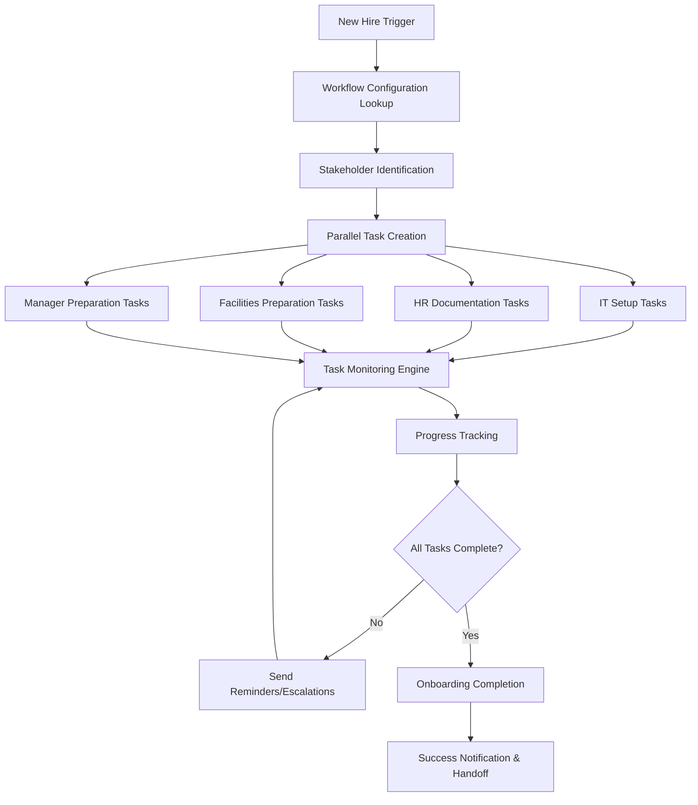

# ADMIN_007: Employee Onboarding Workflow Automation
## Configurable Multi-Step Onboarding Process Management

### 📋 Skill Overview
```yaml
skill_id: "ADMIN_007"
skill_name: "Employee Onboarding Workflow Automation"
domain: "Administration"  
implementation_level: "Calibration Required"
priority: "High"
complexity_score: 6
estimated_dev_hours: 60-100
```

### 🎯 Business Objective
- **Primary Goal**: Automate complex, multi-stakeholder onboarding workflows with company-specific rules and approval chains
- **Success Metrics**: 
  - Onboarding completion time: 50% reduction (from 2-3 weeks to 1 week)
  - Process compliance: >98% completion of required steps
  - New hire satisfaction: >4.5/5.0 onboarding experience rating
  - HR administrative time: 75% reduction in manual coordination
- **User Personas**: HR Coordinators, IT Support, Facilities, Direct Managers, New Hires
- **ROI Impact**: $15,000-30,000 per year (efficiency + experience improvement)

### 🔧 Technical Requirements

#### Core Functions
```yaml
primary_function: "execute"
input_types: 
  - "new_hire_data" # Employee information, start date, role, department
  - "workflow_triggers" # Manual initiation or automated from offer acceptance
  - "approval_responses" # Stakeholder approvals and task completions
  - "configuration_rules" # Company-specific workflow definitions
output_types:
  - "task_assignments" # Automated task distribution to stakeholders
  - "status_updates" # Real-time progress tracking and notifications
  - "compliance_reports" # Completion tracking and audit trails
  - "escalation_alerts" # Overdue tasks and bottleneck notifications
```

#### System Connections
```yaml
sap_modules:
  - "SuccessFactors_Employee_Central"
  - "Organization_Management"
  - "Position_Management"
  - "Workflow_Engine"
external_systems:
  - "Active_Directory" # IT account provisioning
  - "Office365_Admin" # Email, Teams, SharePoint access
  - "Badge_System_API" # Physical access card generation
  - "Equipment_Management" # Laptop/hardware provisioning
  - "Learning_Management_System" # Required training assignments
  - "Payroll_System" # Benefits enrollment, tax forms
mcp_protocols:
  - "Workflow_State_Management" # Process status and handoffs
  - "Task_Assignment_Protocol" # Stakeholder notification system
  - "Document_Management" # Forms, contracts, policy acknowledgments
```

### 🏗️ Technical Architecture

#### Logic Flow


#### Required Tools
- **Workflow Engine**: 
  - Multi-step process orchestration
  - Parallel and sequential task management
  - Conditional branching based on role, location, department
  - SLA monitoring and escalation rules
- **Task Management**: 
  - Automated task assignment and distribution
  - Stakeholder notification system (email, Teams, mobile)
  - Progress tracking and status updates
  - Document collection and approval workflows
- **Integration Layer**: 
  - API connectors for external systems (IT, Facilities, etc.)
  - Data mapping and transformation between systems
  - Error handling and retry mechanisms
  - Audit logging for compliance tracking
- **Configuration Engine**: 
  - Visual workflow designer for business users
  - Role-based task templates and dependencies
  - Company-specific business rules engine
  - Approval hierarchy management

### 📊 Implementation Specifications

#### Calibration Required Level
```yaml
setup_time: "2-4 weeks"
configuration_required: true
business_analysis_phase: "1 week discovery of current processes"
workflow_design_phase: "1 week mapping new automated processes"  
system_integration_phase: "1-2 weeks connecting external systems"
testing_validation_phase: "1 week end-to-end workflow testing"

calibration_components:
  workflow_templates:
    - "Role-specific onboarding paths (executive, manager, individual contributor)"
    - "Department-specific requirements (IT, Finance, Sales, etc.)"
    - "Location-specific compliance (office access, local regulations)"
  
  approval_hierarchies:
    - "Multi-level approval chains for equipment/access requests"
    - "Budget approval workflows for expensive equipment"
    - "Security clearance processes for sensitive roles"
  
  integration_mappings:
    - "Custom field mappings between SAP and external systems"
    - "Data transformation rules for different system formats"
    - "Error handling procedures for integration failures"
```

### 🎨 Client Workshop Materials

#### Discovery Questions
1. **Current Process Mapping**: "Walk me through your current onboarding process step-by-step. Who's involved? How long does each step take?"
2. **Stakeholder Responsibilities**: "What tasks does IT handle? Facilities? Direct managers? HR?"
3. **Approval Requirements**: "What needs approval? Who approves what? Any spending limits or special authorization needs?"
4. **System Landscape**: "What systems do you use for IT provisioning? Equipment management? Learning platforms?"
5. **Compliance Requirements**: "Any regulatory or audit requirements for onboarding documentation and completion tracking?"
6. **Role Variations**: "How does onboarding differ for executives vs managers vs individual contributors?"
7. **Location Differences**: "Different processes for different offices or remote workers?"
8. **Pain Points**: "What goes wrong most often? Where do new hires get stuck or frustrated?"

#### Configuration Options
```yaml
workflow_templates:
  - template_name: "Standard Employee"
    description: "Default onboarding for individual contributors"
    duration: "5 business days"
    parallel_streams: ["IT Setup", "HR Documentation", "Manager Prep"]
    
  - template_name: "Manager/Leadership"
    description: "Additional leadership-specific requirements"
    duration: "10 business days"
    additional_steps: ["Leadership Training", "Budget Access", "Team Introductions"]
    
  - template_name: "Executive"
    description: "C-level and VP onboarding with board involvement"
    duration: "15 business days"
    additional_approvals: ["Board Notification", "Press Release", "Executive Assistant"]

task_categories:
  - category: "IT Provisioning"
    configurable_tasks:
      - "Active Directory Account Creation"
      - "Email/Office365 Setup"  
      - "VPN Access Configuration"
      - "Software License Assignment"
      - "Hardware Ordering and Setup"
    sla_default: "2 business days"
    escalation_after: "1 day overdue"
    
  - category: "HR Documentation"
    configurable_tasks:
      - "Employee Handbook Acknowledgment"
      - "Benefits Enrollment"
      - "Tax Form Collection (W-4, State, etc.)"
      - "Emergency Contact Information"
      - "Direct Deposit Setup"
    sla_default: "3 business days"
    required_approvals: ["HR Manager Review"]

business_rules:
  - rule_name: "Equipment Budget Approval"
    condition: "Total equipment cost > $2,500"
    action: "Require Director-level approval"
    configurable: true
    
  - rule_name: "Security Clearance Required"
    condition: "Role requires access to confidential data"
    action: "Trigger background check workflow"
    configurable: true
    
  - rule_name: "Remote Worker Setup"
    condition: "Employee location = Remote"
    action: "Add home office setup and shipping tasks"
    configurable: true
```

#### Success Criteria
- **Process Efficiency**: 
  - 50% reduction in onboarding completion time
  - 90% of tasks completed within SLA timeframes
  - Zero missed compliance requirements
- **Stakeholder Experience**: 
  - HR coordinators: 75% reduction in manual coordination time
  - IT team: Automated account provisioning reduces setup time by 60%
  - Managers: Clear visibility into preparation requirements and progress
  - New hires: Streamlined experience with proactive communication
- **System Performance**: 
  - Workflow initiation time: <2 minutes from trigger
  - Task assignment delivery: <5 minutes via email/Teams
  - Status update frequency: Real-time progress tracking
  - System availability: 99.5% during business hours
- **Compliance & Audit**: 
  - 100% audit trail for all onboarding activities
  - Automated compliance reporting for regulatory requirements
  - Document retention and retrieval capabilities

### 🔍 Testing & Validation

#### Test Scenarios
```yaml
workflow_testing:
  - "Standard employee onboarding end-to-end"
  - "Manager onboarding with additional approval steps"
  - "Executive onboarding with board notification requirements"
  - "Remote employee setup with shipping and home office tasks"
  - "International employee with visa/work authorization workflows"
  
integration_testing:
  - "Active Directory account creation and group assignments"
  - "Office365 provisioning with appropriate licenses"
  - "Equipment ordering system integration and tracking"
  - "Learning management system course assignment"
  
error_handling_testing:
  - "System unavailability scenarios (IT systems down)"
  - "Approval delays and escalation procedures"
  - "Invalid data handling and error notifications"
  - "Partial completion scenarios and resume capabilities"
```

#### Quality Assurance
- **Workflow Logic**: End-to-end testing of all onboarding paths and variations
- **Integration Reliability**: Comprehensive testing of external system connections
- **Data Accuracy**: Validation of data transfer and transformation between systems
- **User Experience**: Usability testing with actual stakeholders (HR, IT, managers)
- **Performance Under Load**: Testing with multiple concurrent onboarding processes

### 📈 Performance Optimization

#### Scalability Factors
```yaml
concurrent_workflows: "Support 50+ simultaneous onboarding processes"
task_throughput: "Process 500+ task assignments per hour"
notification_volume: "Send 1000+ notifications daily without delays"
data_synchronization: "Real-time updates across integrated systems"

performance_targets:
  workflow_initiation: "<2 minutes from trigger to first task assignment"
  status_updates: "<30 seconds for progress tracking updates"
  notifications: "<5 minutes for task assignment delivery"
  reporting: "<10 seconds for real-time dashboard updates"
```

#### Monitoring & Analytics
```yaml
workflow_metrics:
  - "Average onboarding completion time by role/department"
  - "Task completion rates and SLA adherence"
  - "Bottleneck identification and escalation frequency"
  - "Stakeholder responsiveness and participation rates"

business_analytics:
  - "New hire satisfaction correlation with onboarding efficiency"
  - "Time-to-productivity measurement for onboarded employees"
  - "Cost per hire reduction through automation"
  - "Compliance audit readiness and documentation completeness"
  
system_health:
  - "Integration uptime and error rates"
  - "Workflow engine performance and resource utilization"
  - "Notification delivery success rates"
  - "Data synchronization accuracy and timeliness"
```

### 💰 Cost & ROI Analysis

#### Implementation Costs
```yaml
analysis_and_design: 
  - "Business Process Analysis: 1 week @ $175/hour = $7,000"
  - "Workflow Design & Configuration: 1 week @ $150/hour = $6,000"
  - "Integration Architecture: 3 days @ $200/hour = $4,800"

development_implementation:
  - "Workflow Engine Configuration: 2 weeks @ $150/hour = $12,000"  
  - "System Integration Development: 2 weeks @ $175/hour = $14,000"
  - "User Interface Customization: 1 week @ $125/hour = $5,000"

testing_and_deployment:
  - "End-to-End Testing: 1 week @ $150/hour = $6,000"
  - "User Training & Change Management: 3 days @ $125/hour = $3,000"
  - "Go-Live Support: 1 week @ $175/hour = $7,000"

total_implementation: "$64,800"

annual_maintenance:
  - "System Updates & Enhancements: $8,000/year"
  - "Integration Monitoring: $4,000/year" 
  - "User Support: $3,000/year"
  - "Total Maintenance: $15,000/year"
```

#### Expected Benefits
```yaml
efficiency_improvements:
  - "HR Coordinator time savings: 20 hours/month @ $50/hour = $12,000/year"
  - "IT Setup automation: 30 hours/month @ $75/hour = $27,000/year"
  - "Manager preparation efficiency: 10 hours/month @ $100/hour = $12,000/year"
  - "Total Direct Savings: $51,000/year"

quality_and_experience:
  - "Faster time-to-productivity: 3 days earlier @ $200/day value = $36,000/year"
  - "Reduced onboarding errors: 50% fewer mistakes = $8,000/year savings"
  - "Improved new hire retention: 10% better retention = $25,000/year"
  - "Compliance risk reduction: Audit readiness value = $15,000/year"
  - "Total Quality Benefits: $84,000/year"

competitive_advantages:
  - "Enhanced employer brand through superior onboarding experience"
  - "Faster integration of new talent into productive roles"
  - "Reduced administrative burden allows HR focus on strategic initiatives"
  - "Scalable process supports rapid hiring and company growth"
```

#### 3-Year ROI Calculation
- **Year 1**: Investment $79,800, Benefits $135,000, Net ROI: 69%
- **Year 2**: Investment $15,000, Benefits $140,000, Net ROI: 833%  
- **Year 3**: Investment $15,000, Benefits $145,000, Net ROI: 867%
- **Total 3-Year ROI**: 281% (net benefit $530,200 vs investment $109,800)

### 🚀 Deployment Strategy

#### Implementation Phases
1. **Discovery & Design** (Week 1-2):
   - Current state process documentation
   - Future state workflow design
   - Stakeholder requirement gathering
   - Integration architecture planning
   
2. **Configuration & Development** (Week 3-6):
   - Workflow engine setup and configuration
   - External system integration development
   - Custom forms and approval process creation
   - User interface customization
   
3. **Testing & Training** (Week 7-8):
   - End-to-end workflow testing with real scenarios
   - User acceptance testing with stakeholders
   - Training program delivery for all user roles
   - Documentation and support materials creation
   
4. **Pilot & Go-Live** (Week 9-10):
   - Limited pilot with 5-10 new hires
   - Issue identification and resolution
   - Full production deployment
   - Post-go-live support and monitoring

#### Change Management Framework
- **Communication Strategy**: 
  - Executive announcement of onboarding transformation initiative
  - Stakeholder-specific communication about role changes and benefits
  - Regular progress updates and success story sharing
  
- **Training Programs**: 
  - HR team: Advanced workflow management and configuration
  - IT team: Integration monitoring and troubleshooting
  - Managers: New tools for onboarding preparation and tracking
  - New hires: Self-service capabilities and process expectations
  
- **Support Structure**: 
  - Dedicated project team during implementation and early adoption
  - Help desk integration for ongoing user support
  - Documentation library with step-by-step guides and FAQs
  - Monthly user feedback sessions and continuous improvement process

---

*This Calibration Required skill specification demonstrates the complexity of configurable business process automation, ready for client-specific implementation and workshop facilitation.*