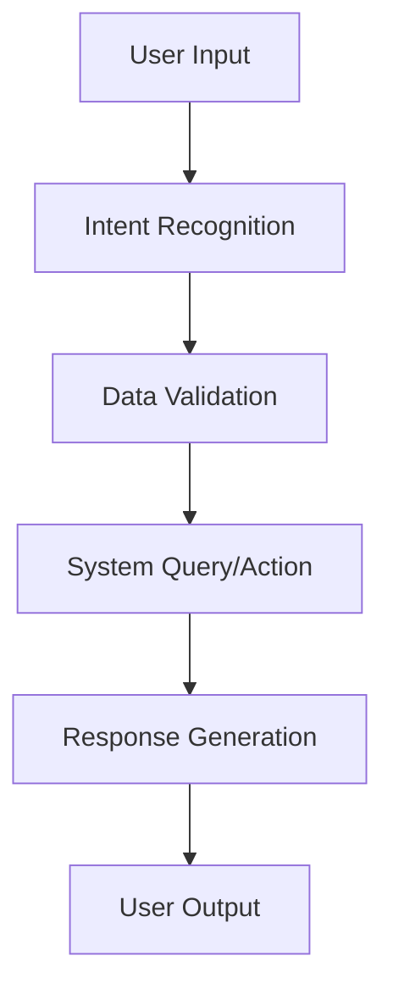

# SKILL SPECIFICATION TEMPLATE
## Dynamic Technical Documentation Framework

### 📋 Skill Overview
```yaml
skill_id: "SKILL_XXX"
skill_name: "Skill Name"
domain: "HR Domain"
implementation_level: "Plug&Play | Calibration | MachineLearning"
priority: "High | Medium | Low"
complexity_score: 1-10
estimated_dev_hours: 0-200
```

### 🎯 Business Objective
- **Primary Goal**: What business problem does this skill solve?
- **Success Metrics**: How is performance measured?
- **User Personas**: Who benefits from this capability?
- **ROI Impact**: Revenue/cost savings potential

### 🔧 Technical Requirements

#### Core Functions
```yaml
primary_function: "retrieve | execute | analyze | generate"
input_types: 
  - "natural_language"
  - "structured_data" 
  - "api_calls"
output_types:
  - "text_response"
  - "data_visualization"
  - "system_action"
  - "file_generation"
```

#### System Connections
```yaml
sap_modules:
  - "SuccessFactors_Module"
  - "Required_Permissions"
external_apis:
  - "Third_Party_System"
  - "Authentication_Method"
mcp_protocols:
  - "Protocol_Type"
  - "Data_Exchange_Format"
```

### 🏗️ Technical Architecture

#### Logic Flow


#### Required Tools
- **NLP Processing**: Intent classification, entity extraction
- **Data Access**: SAP APIs, database queries, file systems
- **Business Logic**: Rules engine, workflow orchestration
- **Output Generation**: Templates, formatters, notifications

### 📊 Implementation Specifications

#### Plug & Play Level
```yaml
setup_time: "0-2 hours"
configuration_required: false
prerequisites:
  - "Standard SAP SuccessFactors access"
  - "Basic user permissions"
```

#### Calibration Required Level  
```yaml
setup_time: "1-5 days"
configuration_required: true
calibration_points:
  - "Business rules customization"
  - "Field mappings"
  - "Workflow adjustments"
  - "Approval hierarchies"
```

#### Machine Learning Level
```yaml
setup_time: "2-6 weeks"
data_requirements:
  - "Historical data volume: XXX records"
  - "Data quality threshold: XX%"
  - "Training period: X months"
model_updates:
  - "Frequency: Weekly/Monthly"
  - "Performance monitoring"
  - "Drift detection"
```

### 🎨 Client Workshop Materials

#### Discovery Questions
1. **Current Process**: "How do you currently handle [process]?"
2. **Pain Points**: "What are the main challenges?"
3. **Volume**: "How many [transactions/users] per month?"
4. **Integration**: "What systems need to connect?"
5. **Customization**: "What specific business rules apply?"

#### Configuration Options
```yaml
customizable_parameters:
  - parameter_name: "Description"
    default_value: "Default"
    client_options: ["Option1", "Option2", "Option3"]
  
business_rules:
  - rule_name: "Business Rule"
    configurable: true/false
    client_specific: true/false
```

#### Success Criteria
- **Functional Requirements**: What must work?
- **Performance Benchmarks**: Speed, accuracy, availability
- **User Adoption**: Training needs, change management
- **Maintenance**: Ongoing support requirements

### 🔍 Testing & Validation

#### Test Scenarios
```yaml
unit_tests:
  - "Core functionality validation"
  - "Error handling verification"
integration_tests:
  - "SAP system connectivity" 
  - "Third-party API integration"
user_acceptance_tests:
  - "Real-world scenario testing"
  - "Performance under load"
```

#### Quality Assurance
- **Data Accuracy**: Validation rules, data integrity checks  
- **Security Compliance**: Access controls, audit trails
- **Performance Metrics**: Response times, throughput capacity
- **Error Handling**: Graceful failures, user notifications

### 📈 Performance Optimization

#### Scalability Factors
- **User Concurrency**: Simultaneous user capacity
- **Data Volume**: Large dataset handling
- **Response Time**: Target performance benchmarks
- **System Resources**: CPU, memory, storage requirements

#### Monitoring & Analytics
```yaml
key_metrics:
  - "Usage frequency"
  - "Success/failure rates"
  - "User satisfaction scores"
  - "System performance indicators"
  
alerting:
  - "Performance degradation"
  - "Error rate thresholds" 
  - "Security anomalies"
```

### 💰 Cost & ROI Analysis

#### Implementation Costs
- **Development Hours**: Technical implementation time
- **Training Hours**: User onboarding and training
- **Infrastructure**: Additional system requirements
- **Ongoing Maintenance**: Support and updates

#### Expected Benefits
- **Time Savings**: Hours saved per user per month
- **Cost Reduction**: Operational efficiency gains
- **Quality Improvement**: Reduced errors, better outcomes
- **User Satisfaction**: Improved employee experience

### 🚀 Deployment Strategy

#### Rollout Phases
1. **Pilot**: Limited user group, core functionality
2. **Beta**: Expanded testing, feature refinement  
3. **Production**: Full deployment, monitoring
4. **Optimization**: Performance tuning, enhancements

#### Change Management
- **Stakeholder Communication**: Executive, management, users
- **Training Programs**: Role-specific skill development
- **Support Structure**: Help desk, documentation, FAQs
- **Feedback Loops**: Continuous improvement process

---

*This template provides the foundation for documenting all 109 HR AI skills with enterprise-grade technical specifications.*